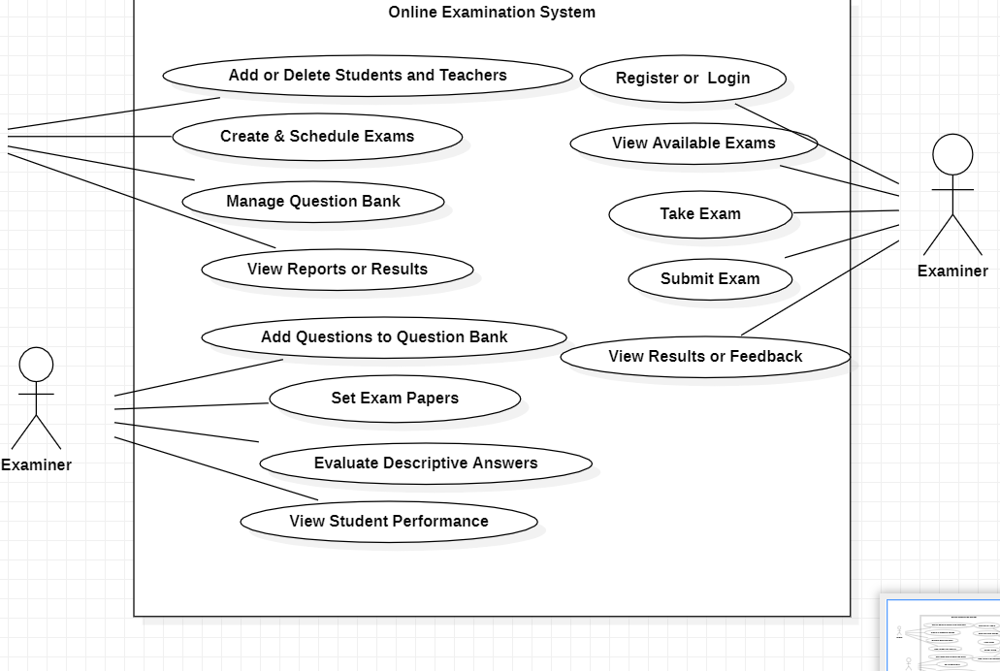
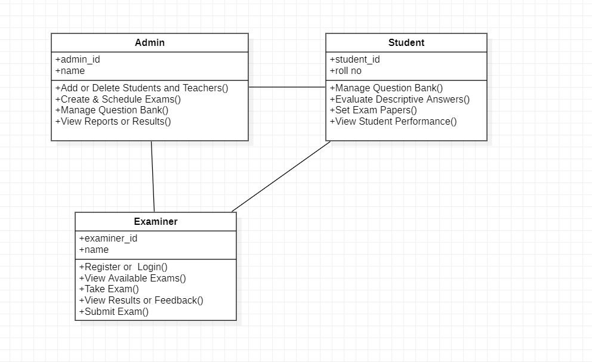
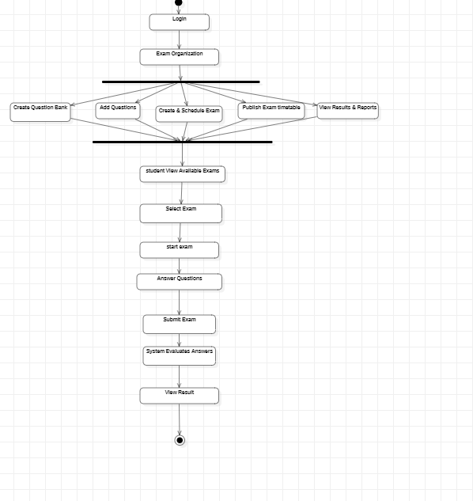
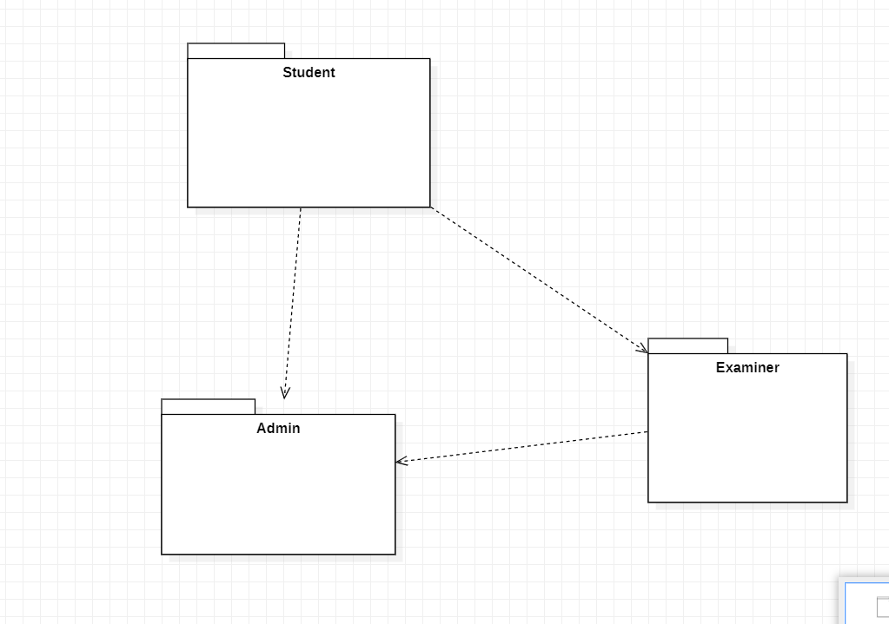
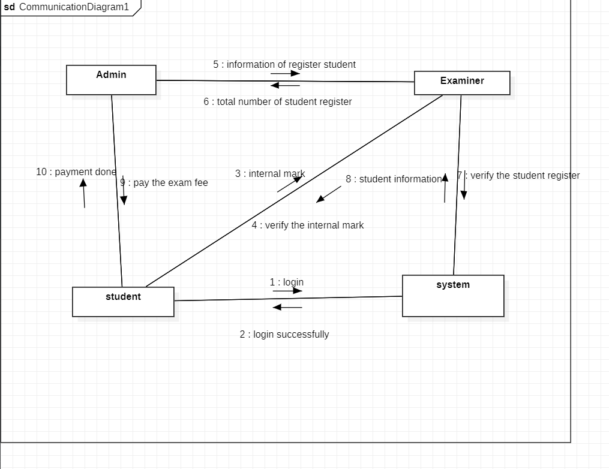
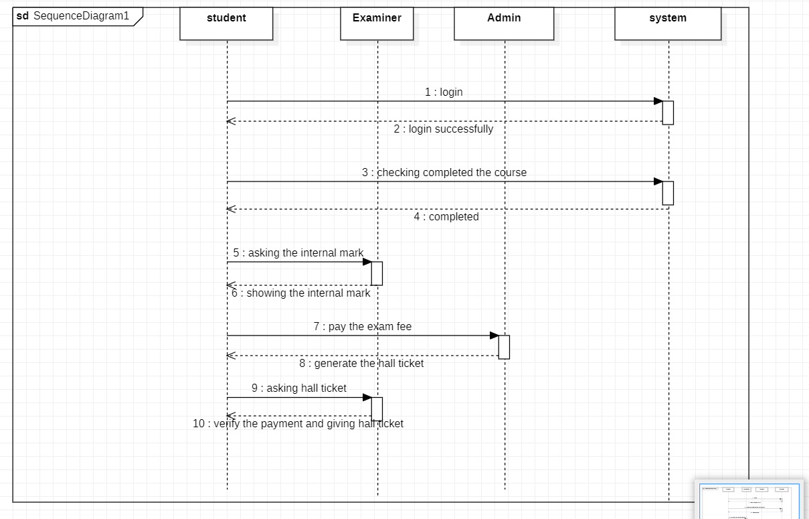

# Exp - 6 STUDENT ONLINE EXAM REGISTRATION SYSTEM

# AIM:
To study the problem statement ,SRS document and draw the UML diagram of student online exam registration system .

# SRS (Procedure):
Create the following diagrams in StarUML:

Use Case Diagram

Class Diagram

Activity Diagram

Package Diagram

Communication Diagram

Sequence Diagram

1 . Students create an account and log in to the online exam registration system using valid credentials.

2 . The system verifies student details with the database, and only approved students can proceed with registration.

3 . Students register for exams by selecting their subjects or courses, and the system records these registrations.

4 . Students pay exam fees online, after which the system generates digital receipts as proof of payment.

5 . The exam cell schedules and manages exam timetables, ensuring registered students are assigned to the correct exams.

6 . On the exam day, students attend the exams, and faculty invigilate as required.

7 . After the exam, the system generates results and reports automatically, storing them securely for future reference.

# DIAGRAMS:
(upload all 6 diagrams)

# USE CASE DIAGRAM:

# Class Diagram:

# Activity Diagram:

# Package Diagram:

# Communication Diagram:

# Sequence Diagram:

# RESULT:
Thus, the UML Diagrams for a Student Online Exam Registration System has been drawn and verified.

